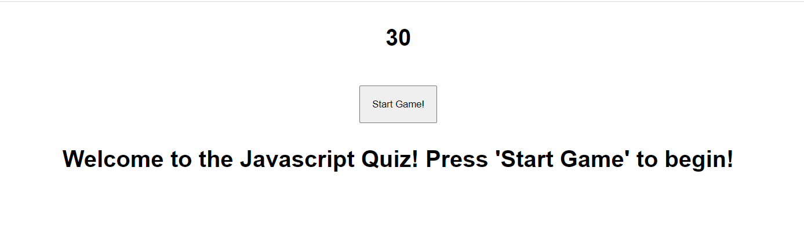
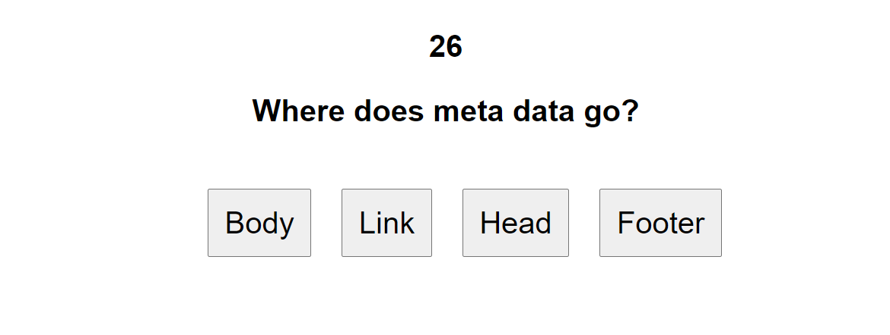
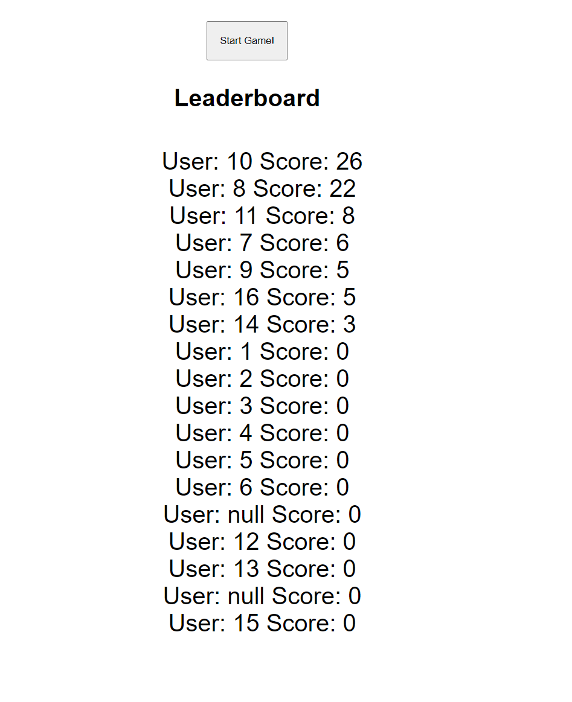

This is a Javascrip quiz! 

When you press "Start Game" the quiz will begin.

You will have 30 seconds to answer all four questions. If you get a question wrong, it will deduct 10 seconds from the counter.

The game will then prompt you for your initials and add you to the leaderboard! Play as many times as you would like!

https://jlewis1995.github.io/JavascriptQuiz/

